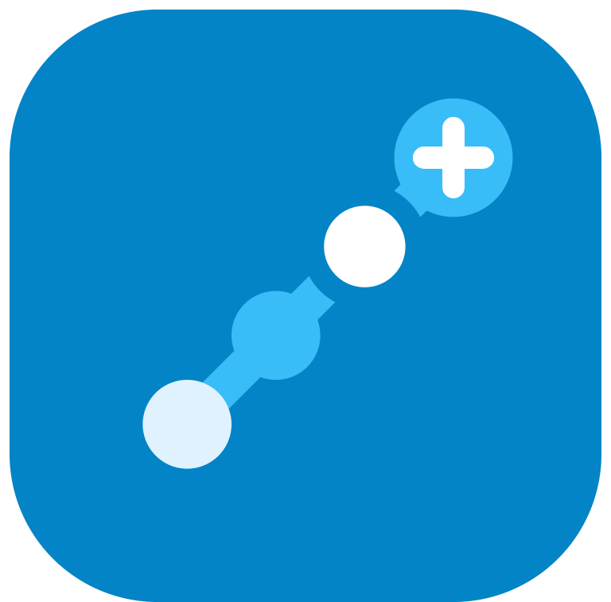

<a id="readme-top"></a>

<!-- PROJECT LOGO -->
<br />
<div align="center">
  <a href="https://github.com/Hammamujahid/nextstep">
    
  </a>

  <h3 align="center">NextStep</h3>

  <p align="center">
    Career workspace: goals, projects, tasks, dan job applications dalam satu tempat.
    <br />
    <a href="https://github.com/Hammamujahid/nextstep"><strong>Explore the docs »</strong></a>
    <br />
    <br />
    <a href="https://github.com/Hammamujahid/nextstep/issues/new?labels=bug&template=bug-report---.md">Report Bug</a>
    &middot;
    <a href="https://github.com/Hammamujahid/nextstep/issues/new?labels=enhancement&template=feature-request---.md">Request Feature</a>
  </p>
</div>

<!-- TABLE OF CONTENTS -->
<details>
  <summary>Table of Contents</summary>
  <ol>
    <li>
      <a href="#about-the-project">About The Project</a>
      <ul>
        <li><a href="#built-with">Built With</a></li>
      </ul>
    </li>
    <li>
      <a href="#getting-started">Getting Started</a>
      <ul>
        <li><a href="#prerequisites">Prerequisites</a></li>
        <li><a href="#installation">Installation</a></li>
      </ul>
    </li>
  </ol>
</details>

<!-- ABOUT THE PROJECT -->
## About The Project

NextStep adalah career workspace untuk developer: goals, projects, tasks, dan job applications dikelola dalam satu tempat — dengan workspace, role member, dan permission per resource (`none` / `viewer` / `editor`).

Fitur utama:

* **Goals** dengan progress otomatis dari tasks & projects yang terhubung
* **Tasks** dengan prioritas, status, due date, estimasi, dan assignee
* **Projects** dengan status, progress, dan assignee
* **Job applications** dengan pipeline status (wishlist → offer), due date, dan link lowongan
* **Workspaces & members**: undang anggota, atur permission per resource, hapus member
* **Auth aman**: sesi cookie HttpOnly (`ns_access` / `ns_refresh`), refresh rotation, rate limiting, audit log, security headers

<p align="right">(<a href="#readme-top">back to top</a>)</p>

### Built With

* [![Go][Go.dev]][Go-url]
* [![Gin][Gin.dev]][Gin-url]
* [![PostgreSQL][PostgreSQL.org]][PostgreSQL-url]
* [![Next][Next.js]][Next-url]
* [![React][React.js]][React-url]
* [![TailwindCSS][Tailwind.com]][Tailwind-url]

<p align="right">(<a href="#readme-top">back to top</a>)</p>

<!-- GETTING STARTED -->
## Getting Started

Untuk menjalankan salinan lokal, ikuti langkah di bawah. Detail arsitektur dan aturan kerja ada di `AGENTS.md`.

### Prerequisites

* Go 1.27+
  ```sh
  go version
  ```
* Node.js 20+ & npm
  ```sh
  node --version
  npm --version
  ```
* PostgreSQL 15+ (database lokal `nextstep`)
* [golang-migrate](https://github.com/golang-migrate/migrate) CLI untuk migrasi
  ```sh
  migrate -version
  ```

### Installation

1. Clone repo
   ```sh
   git clone https://github.com/Hammamujahid/nextstep.git
   cd nextstep
   ```
2. Salin environment dan isi nilainya
   ```sh
   cp .env.example .env
   ```
   Isi minimal: `DB_*` (Postgres lokal), `JWT_SECRET` (acak, min. 32 char untuk production), `FRONTEND_URL=http://localhost:3000`, kredensial Google bila memakai login Google.
3. Buat database + jalankan migrasi (dari folder `backend/`)
   ```sh
   createdb -h localhost -U postgres nextstep
   migrate -path migrations -database "postgres://postgres:<password>@localhost:5432/nextstep?sslmode=disable" up
   ```
4. Jalankan backend (dari folder `backend/`)
   ```sh
   go build -o server.exe ./cmd/server
   ./server.exe   # :8080, satu instance saja — restart setiap rebuild
   ```
5. Install & jalankan frontend (dari folder `frontend/`)
   ```sh
   npm install
   npm run dev    # :3000
   ```
6. Buka `http://localhost:3000`, register akun pertama, dan mulai buat workspace.

<p align="right">(<a href="#readme-top">back to top</a>)</p>

<!-- MARKDOWN LINKS & IMAGES -->
<!-- https://www.markdownguide.org/basic-syntax/#reference-style-links -->
[Go.dev]: https://img.shields.io/badge/Go-00ADD8?style=for-the-badge&logo=go&logoColor=white
[Go-url]: https://go.dev/
[Gin.dev]: https://img.shields.io/badge/Gin-00ACD7?style=for-the-badge&logo=gin&logoColor=white
[Gin-url]: https://gin-gonic.com/
[PostgreSQL.org]: https://img.shields.io/badge/PostgreSQL-4169E1?style=for-the-badge&logo=postgresql&logoColor=white
[PostgreSQL-url]: https://www.postgresql.org/
[Next.js]: https://img.shields.io/badge/next.js-000000?style=for-the-badge&logo=nextdotjs&logoColor=white
[Next-url]: https://nextjs.org/
[React.js]: https://img.shields.io/badge/React-20232A?style=for-the-badge&logo=react&logoColor=61DAFB
[React-url]: https://reactjs.org/
[Tailwind.com]: https://img.shields.io/badge/Tailwind_CSS-38BDF8?style=for-the-badge&logo=tailwind-css&logoColor=white
[Tailwind-url]: https://tailwindcss.com/
